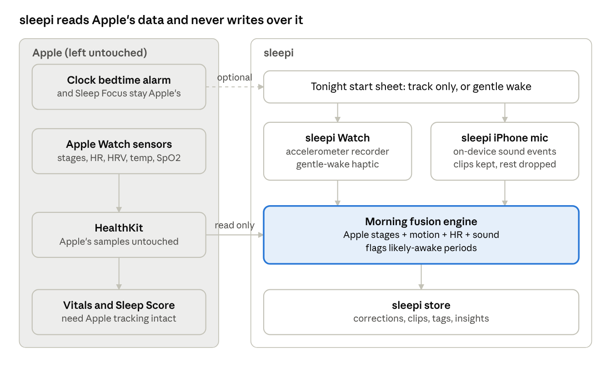
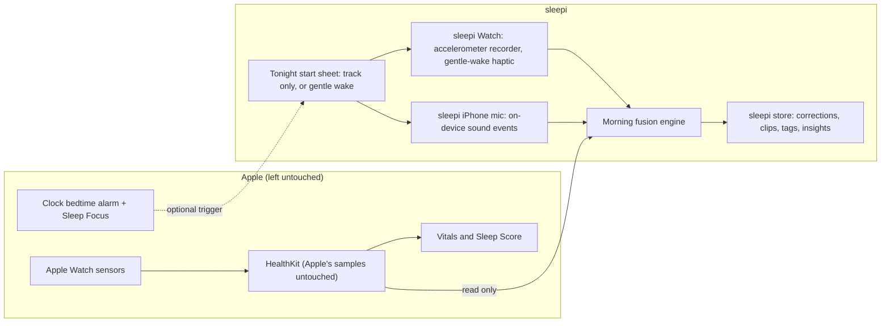

# sleepi: Research, Plan and Concept

Oct 1, 2026 · Randy · Live version: https://claude.ai/code/artifact/8126ccb9-50b5-4cee-b31c-5a7136c94baa

Other files in this folder: `02-market-research.md`, `03-apple-platform-research.md`, `04-sleep-science-research.md` (full research notes behind this plan) and `architecture.png` (the diagram in the Architecture section).

## Summary for Astra

sleepi is a calm iPhone and Apple Watch sleep app that sits on top of Apple's sleep stack instead of replacing it. Apple keeps doing the sensing, the schedule, the alarm and the Vitals; sleepi reads that data, adds the things premium apps sell (sound recording, smarter wake detection, trends, sleep debt, regularity, notes), and writes back only clearly labeled corrections that never collide with Apple's own records.

**The one rule:** if a sleepi feature would change what Apple Health, the Vitals app, Activity rings or the Clock bedtime alarm would otherwise show, it does not ship. Every feature in this plan was checked against that rule.

**Defaults picked (no input needed from Randy unless they disagree):**

- Targets: iOS 26 or later and watchOS 26 (the Series 8 can't run watchOS 27), Swift 6, SwiftUI, tested on iPhone plus Apple Watch Series 8.
- No overnight workout session on the Watch, ever. This is the root cause of Sleep Smart's false calories and missing Vitals.
- No sleepi alarm by default. The native Clock bedtime alarm stays the alarm. An optional gentle wake nudge exists only as an add-on that never cancels or moves Apple's alarm.
- Audio is processed on the iPhone and only short clips of interesting events are kept; nothing leaves the device.
- Free personal app with no account, no server and no subscription. Data lives in HealthKit plus a local store synced through the user's own iCloud.
- Not a medical device: snoring and breathing insights are described as observations, never diagnoses.

## Market research: what paid apps add over Apple Health

Premium sleep apps sell five things Apple doesn't: sound recording (snoring, talking), a wake window, trends with explanations (debt, regularity, readiness), tags that correlate habits with sleep, and nap detection. The best-reviewed ones (AutoSleep, NapBot) get there by reading Apple's data passively; the worst-reviewed ones fight Apple by running their own sessions, writing duplicate data, or replacing the alarm.

| App | Price (US) | How it collects data | What it adds over Apple | Top complaints |
| --- | --- | --- | --- | --- |
| [Sleep Cycle](https://apps.apple.com/us/app/sleep-cycle-tracker-sounds/id320606217) | Free; Premium about $39.99/yr | iPhone mic or motion; own Watch app with motion and HR | Wake window, silent haptic wake, snore and talk detection, notes, trends, mood ([tiers](https://support.sleepcycle.com/hc/en-us/articles/206704909-Sleep-Cycle-Freemium-vs-Premium-Features)) | Bloat, subscription, redesign hid raw graphs, notes can't be renamed |
| [AutoSleep](https://apps.apple.com/us/app/autosleep-track-sleep-on-watch/id1164801111) | $5.99 once | Passive HealthKit reads, nothing to start | Readiness, HRV rings, auto naps | Dense UI; duplicates Apple sleep in Health |
| [Pillow](https://apps.apple.com/us/app/pillow-smart-sleep-cycle-alarm/id878691772) | $49.99/yr or lifetime | Auto mode reads Health; manual session for alarm and audio | Snore and talk audio on device, wake window | No alarm or audio in auto mode ([Pillow](https://pillow.app/automatic-sleep-tracking-for-the-apple-watch)); battery |
| [SleepWatch](https://apps.apple.com/us/app/sleepwatch-top-sleep-tracker/id1138066420) | $39.99/yr | Reads Health | Coaching, reports, snore | Adds its own inaccurate data to Health; score swings |
| [Rise](https://apps.apple.com/us/app/rise-sleep-tracker/id1453884781) | $69.99/yr | Health plus phone usage | Sleep debt, circadian energy curve, melatonin window | Price |
| [SleepSpace](https://apps.apple.com/app/id1193763939) | $79/yr | Phone, Watch, rings | Watch haptic wake, sound masking, CBT-I programs | Bugs, hard-to-stop alarm, paywall |
| [ShutEye](https://apps.apple.com/US/app/id1490078804) | $79.99/yr | iPhone mic | Snore and talk recordings, sounds | Recordings paywalled after collection; cross-app tracking |
| [NapBot](https://apps.apple.com/us/app/id1476436116) | $29.99/yr | Passive HealthKit plus on-device CoreML | Auto naps, stages | Sitting still read as sleep |
| [Sleep++](https://apps.apple.com/us/app/sleep/id1038440371) | Free, $1.99 no ads | Watch motion plus Health | Readiness, vitals trends, widgets | Misdetected 13-hour nights |
| [SnoreLab](https://apps.apple.com/us/app/snorelab-record-your-snoring/id529443604) | Up to $59.99/yr | iPhone mic | Snore Score, highlights, remedy tracking, audio kept on device | Snoring only; 210 MB app |
| Oura, Whoop, Eight Sleep | $399 ring plus $70/yr and up | Own hardware | Readiness from HRV, RHR, temperature | Subscriptions on top of hardware |

On **Sleep Smart**: the App Store listing we could find ([SleepSmart](https://apps.apple.com/us/app/id1438013403)) is tied to pillow hardware, and no public report of its Health problems turned up, so Randy's experience is the evidence. The mechanism is well documented, though: a Watch workout session affects Move and Exercise rings even without saving a workout ([Apple forums](https://developer.apple.com/forums/thread/810690)), and Apple's own docs point non-workout apps to separate session types for exactly that reason ([Apple](https://developer.apple.com/documentation/watchkit/using-extended-runtime-sessions)).

**Worth copying:** passive tracking with no session to start (AutoSleep, NapBot); a Watch haptic wake through the smart alarm runtime session, not a workout; on-device snore and talk audio with highlights kept and the rest discarded (SnoreLab); renameable tags with correlations; nap detection; raw graphs next to every score; a one-time or free price.

**Anti-patterns sleepi avoids:** overnight workout sessions; duplicate sleep written to Health ([Exist](https://kb.exist.io/article/42-why-is-my-sleep-data-incorrect) recommends only one app syncing sleep); recordings held hostage behind a paywall; features that can't be turned off; treating Sleep Focus or sitting still as sleep onset; ad and tracking SDKs in a health app.

## What Apple already does, and what apps can touch

Apple already covers sensing, staging, Vitals, a Sleep Score and the schedule; apps can read almost all of it but can change almost none of it, which is exactly the boundary sleepi should live inside.

**Important for Randy's hardware:** watchOS 27 (fall 2026) dropped the Series 8, so the Watch app must target watchOS 26 as its floor ([MacRumors](https://www.macrumors.com/2026/06/08/watchos-27-drops-support-for-apple-watch-series-9-ultra-se-2/)). The Series 8 also cannot get Apple's sleep apnea notifications (Series 9 and later only, [Apple](https://support.apple.com/en-gb/120031)).

| Apple feature | What it gives | Can sleepi read it? | Can sleepi change it? |
| --- | --- | --- | --- |
| [Sleep stages](https://support.apple.com/en-us/108906) | Awake, REM, Core, Deep, written after the night | Yes, `sleepAnalysis` samples, filtered by source | No. Apps can only delete their own samples ([HKHealthStore](https://developer.apple.com/documentation/healthkit/hkhealthstore)) |
| [Sleep Score](https://support.apple.com/guide/watch/view-your-sleep-score-apded441a669/watchos) (watchOS 26) | 0 to 100: duration 50, consistency over 13 nights 30, interruptions 20 | No HealthKit type found; sleepi can recompute its inputs | No |
| [Vitals app](https://support.apple.com/120142) | Overnight heart rate, respiratory rate, SpO2, wrist temp, sleep duration vs a 7-night baseline | Yes, each metric is a HealthKit type | No, and it only works when Apple's own sleep tracking runs undisturbed |
| [Wrist temperature](https://developer.apple.com/documentation/healthkit/hkquantitytypeidentifier/applesleepingwristtemperature) (Series 8+) | One corrected value per night | Yes, from night one | No, read-only type |
| [Breathing disturbances](https://developer.apple.com/documentation/healthkit/hkquantitytypeidentifier/applesleepingbreathingdisturbances) | Elevated or not, per night | Yes, if the Watch records it | No |
| [Sleep schedule, Wind Down, Wake Up alarm](https://support.apple.com/guide/watch/apd830528336) | Schedules, Next Wake Up Only edits, Sleep Focus | No public API to read or set it | No |
| [Sleep Focus](https://developer.apple.com/documentation/appintents/setfocusfilterintent) | Turns on at Wind Down | sleepi is told when it turns on or off, if Randy adds sleepi's Focus filter | No |
| [Shortcuts sleep triggers](https://support.apple.com/guide/shortcuts/apd932ff833f/ios) | Wind Down begins, Bedtime begins, Waking Up, alarm stopped | Can run sleepi's App Intents | No; Randy creates the automation once |

Three platform facts shape the whole design:

1. **No live stages.** Apple writes stages only after the night and its classifier is private ([Apple forums](https://developer.apple.com/forums/thread/804512)). So sleepi's "tonight" view uses its own motion and sound, then merges with Apple's stages in the morning.
2. **Health source priority.** A newly added app goes to the top of Data Sources by default, above Apple Watch ([Apple](https://support.apple.com/HT204351)). If sleepi wrote sleep stages naively, Health would start preferring sleepi's guesses over the Watch. That is why corrections are handled carefully below.
3. **Overnight Watch runtime.** Without a workout session, the Watch offers a 12-hour background accelerometer recorder ([CMSensorRecorder](https://developer.apple.com/documentation/coremotion/cmsensorrecorder/recordaccelerometer(forduration:))) and one scheduled 30-minute smart alarm session ([WKExtendedRuntimeSession](https://developer.apple.com/documentation/watchkit/using-extended-runtime-sessions)). That is enough. Apple's own engineers say a workout session for sleep is likely inappropriate for App Review ([Apple forums](https://developer.apple.com/forums/thread/827920)).

## Apple-first ground rules

These are hard requirements for the build and the first things the audit will check.

**Never:**

1. Start an `HKWorkoutSession` or `HKLiveWorkoutBuilder` on the Watch for sleep. This is what logs phantom active calories, competes with Apple's sleep tracking and starves the Vitals app.
2. Write active energy, basal energy, heart rate, HRV, respiratory rate, SpO2 or temperature to HealthKit. sleepi reads vitals; it never adds a second copy.
3. Create alarms that replace the Clock bedtime alarm, or ask Randy to turn Apple's alarm off. sleepi has no API to the schedule and must not pretend to.
4. Auto-start anything from a complication tap. A tap opens a choice, never an action.
5. Upload audio or health data anywhere. Health data also stays out of CloudKit per [App Review 5.1.3](https://developer.apple.com/app-store/review/guidelines/); only sleepi's own non-health settings and notes sync.
6. Make diagnostic claims about apnea or any condition.

**Always:**

1. Read Apple's data first, then add to it. Every night view starts from Apple Watch samples (filtered by `sourceRevision.productType` starting with `Watch`) and layers sleepi's signals on top.
2. Keep Apple's sleep tracking prerequisites intact: sleep schedule on, Sleep Focus on, Watch worn and above 30% at bed. sleepi's onboarding checks and gently reminds about these instead of working around them.
3. Keep corrections inside sleepi by default. Writing corrected sleep back to Health is an opt-in setting, explained in one screen, and follows the correction rules in the architecture section.
4. Fill gaps, never overlap. When Apple has no data for a night (Watch on the charger), sleepi may write its phone-based night as `inBed` plus `asleepUnspecified`, since nothing of Apple's is displaced.
5. Tag everything sleepi writes with metadata (`sleepi.version`, `sleepi.method`) so it can be found, explained and deleted in one tap from Settings.
6. Be battery-polite on the Watch: the accelerometer recorder and one 30-minute smart alarm session are the entire overnight footprint.

## Feature set

sleepi works in two layers: a passive layer that needs nothing from Randy every night, and an optional Tonight layer they start when they want sound recording, finer wake detection or a gentle wake.

### 1. Passive nights (default, zero effort)

- Every morning sleepi reads Apple's sleep stages, heart rate, HRV, respiratory rate, SpO2, wrist temperature and breathing disturbances from HealthKit and builds the night view.
- A morning notification arrives once Apple's data lands (via HealthKit background delivery), for example: "7h 12m asleep, bedtime 18 minutes later than usual."
- Works even if sleepi is never opened at night, so Apple's tracking and Vitals keep running untouched.

### 2. Tonight sessions (optional, started by Randy)

- Started from the iPhone, the Watch app, a Watch complication or a Control Center control. Every entry point opens the same small sheet: **Track only** or **Track and wake me gently**, with the wake time picked fresh each night. Nothing auto-starts.
- Adds three signals Apple doesn't give: iPhone sound, a precise in-bed time (the moment they start), and the Watch's background accelerometer recording.
- Optional automation: a Shortcuts "Bedtime begins" or Sleep Focus trigger can run sleepi's Start intent, which still asks before recording sound. Setup is a one-screen guide, never required.

### 3. Sound: keep the good parts, not 8 hours of audio

- On-device classification with Apple's SoundAnalysis built-in classifier plus a loudness gate. Nothing is uploaded.
- Keeps short clips only for events: snoring, sleep talking, coughing, and loud environmental noise (traffic, dog, door). Each clip has a few seconds of pre-roll from a rolling buffer.
- Keeps for every night: snore minutes and intensity, event timeline, and average and peak room noise in dB.
- Storage budget: clips auto-delete after 14 days unless starred, with a 300 MB cap. At AAC mono 32 kbps a full night would be about 115 MB, so event clips alone typically take a few MB a night (estimate; Astra should measure).
- Partner or pet filter: clips can be marked "not me" and that label is used to tune the threshold.

### 4. Better wake detection (the correction Apple needs)

Research is consistent that the Watch rarely misses sleep but misses about a quarter of real wake time, and underestimates deep sleep (see Sources). sleepi fixes the wake side, which is where it can actually do better:

- Fuses Apple's stages with Watch accelerometer movement, heart rate rises from HealthKit, sound events (rustling, talking) and a body-clock prior from Randy's usual schedule.
- Shows sleepi-detected wake periods as an overlay on Apple's hypnogram, labeled "likely awake," never silently replacing Apple's stages.
- Adds what Apple lacks: time to fall asleep (from the Tonight start or Sleep Focus time to Apple's first sleep sample) and time in bed after waking.
- A one-tap morning check-in ("Up around 3:10?") confirms or rejects big corrections and trains the thresholds over time.
- Deep sleep is shown as an estimate with a 7 to 14 night trend, not a nightly verdict.

### 5. Gentle wake (optional, never replaces Apple's alarm)

- Picks a moment of movement or light sleep in a window of up to 30 minutes before the latest time Randy chose, and taps their wrist with a Watch haptic.
- Runs on the Watch smart alarm runtime session, not a workout. If no good moment appears, it taps at the latest time.
- Apple's Clock alarm stays armed as the real alarm. sleepi's onboarding suggests setting the latest time at or slightly before Apple's alarm, so Apple's alarm is the fallback.
- Evidence for stage-timed alarms is modest (waking from deep sleep worsens grogginess, but consumer smart alarms have weak trial evidence), so it is presented as "gentler waking," not a proven benefit.

### 6. Insights that hold up

- **Regularity first:** Sleep Regularity Index over 14 nights as the headline, since it has the strongest health evidence and is robust to staging errors.
- **Sleep debt:** rolling 14-night shortfall against Randy's own target, shown as a soft trend.
- **Social jetlag and chronotype:** mid-sleep on free days vs school days.
- **Overnight vitals:** Apple's Vitals metrics against Randy's own baseline, with a link into the Vitals app rather than a copy of it.
- **Recovery:** a simple, explained score from HRV, resting HR, wrist temperature and respiratory rate vs a 30-day baseline, with the raw numbers always one tap away.
- **Tags and correlations:** renameable tags (caffeine, alcohol, late workout, screen time, stress) and "nights with X vs without" comparisons once there are enough nights.
- **Gentle nudges:** caffeine cutoff about 6 hours before usual bedtime, consistent wake time, and "out of bed if awake 20 minutes" coaching. No self-guided sleep restriction.

### Later (v2)

- Nap detection from daytime HealthKit data.
- Wind-down sounds, with echo handling so sleepi doesn't record its own audio.
- Phone-only nights written to Health as gap fills when the Watch was charging.

## Architecture and technical design

Apple's sensors and HealthKit are the source of truth; sleepi adds two local sensors (iPhone mic, Watch accelerometer recorder), fuses everything in the morning on the iPhone, and keeps its results in its own store.

Arrows only point into sleepi: nothing flows back into HealthKit, the Clock alarm or the Vitals app in v1.

### Targets and modules

- iOS 26+ app, watchOS 26 app (floor fixed by the Series 8), shared Swift package `SleepiCore` for models and the fusion engine. SwiftUI, Swift 6 strict concurrency, SwiftData for local storage, App Intents for every action, WidgetKit for widgets, complications and controls.
- No third-party SDKs: no analytics, ads, crash reporters or accounts.

### HealthKit

- **Read:** `sleepAnalysis`, `heartRate`, `heartRateVariabilitySDNN`, `restingHeartRate`, `respiratoryRate`, `oxygenSaturation`, `appleSleepingWristTemperature`, `appleSleepingBreathingDisturbances`.
- **Write (v1):** nothing by default. Optional later: gap-fill nights, and corrections (see below). Never energy, workouts or vitals.
- Apple's samples are identified by `sourceRevision.productType` beginning with `Watch` and Apple's bundle IDs; sleepi's own samples carry `sleepi.*` metadata.
- `HKObserverQuery` with background delivery on `sleepAnalysis` triggers the morning build; an `HKAnchoredObjectQuery` picks up late or edited samples so a night is rebuilt if Apple revises it.

### Writing corrections back to Health (opt-in, gated)

Health puts a newly added app above Apple Watch in Data Sources, and its merge rules for overlapping sleep are undocumented. So the v1 build stores corrections only inside sleepi. A hidden Labs toggle lets Astra and Randy test writing user-confirmed `awake` segments to Health and record exactly what happens to Health's Sleep chart, Sleep Score and Vitals. It ships on by default only if that test shows Apple's views stay intact.

### Watch overnight

- At Tonight start: `CMSensorRecorder.recordAccelerometer(forDuration:)` for up to 12 hours. The system records at 50 Hz even while sleepi is suspended.
- If a gentle wake is chosen: schedule one `WKExtendedRuntimeSession` of the smart alarm type to start 30 minutes before the chosen latest time. Inside it, read motion and heart rate, choose the moment, and call `notifyUser(hapticType:)`. The session must always end with a haptic, or watchOS warns the user.
- In the morning the Watch app reduces the raw recording to 30-second activity counts and sends them to the iPhone with WatchConnectivity `transferFile`. Raw data never leaves the Watch.
- Known risk: a developer reported empty recordings during Apple's own sleep detection ([Apple forums](https://developer.apple.com/forums/thread/827920)). Milestone 1 tests this first; if it fails, sleepi falls back to Apple's data plus phone sound.

### iPhone overnight sound

- `AVAudioSession` category `.record`, mode `.measurement`, background mode `audio`, started in the foreground from the Start sheet. Recording visibly shows the orange mic indicator and a Live Activity, which satisfies [App Review 2.5.14](https://developer.apple.com/app-store/review/guidelines/).
- Pipeline: 1-second buffers feed a loudness meter and `SNClassifySoundRequest` (built-in classifier, on device). A 10-second rolling buffer supplies pre-roll. Events above confidence and loudness thresholds write an AAC clip; everything else is discarded after analysis.
- Handles interruptions (calls, Siri, alarms) by pausing and resuming, and reminds Randy to keep the phone on the charger.
- Astra should print the classifier's label list on device to confirm which labels exist (snoring, speech, cough are expected but unverified).

### Fusion engine (morning, on iPhone)

- Timeline of 30-second epochs from in-bed to out-of-bed. Each epoch holds Apple's stage, Watch activity count, interpolated heart rate, sound event flags and a body-clock prior.
- v1 rules: flag "likely awake" when Apple says asleep but movement is above threshold for 2 or more epochs together with a heart-rate rise or a rustling or speech event. Thresholds tuned per user from check-in answers.
- v2 model: a small Core ML classifier trained on the public [Walch et al. Apple Watch PSG dataset](https://physionet.org/content/sleep-accel/1.0.0/) (accelerometer, heart rate, clock), benchmarked against Apple-only wake detection before shipping.

### Storage and privacy

- SwiftData store in an App Group so widgets can read summaries. Audio clips in the app container with complete file protection.
- CloudKit private database syncs only tags, settings and notes, not health values or audio.
- One Settings screen lists everything sleepi has written to Health and deletes it in one tap.

## UX concept

Calm by default: dark, low-contrast night palette, one number per screen that matters, raw data one tap below, and no streaks, badges or nags.

### iPhone

1. **Onboarding (4 screens):** what sleepi does and doesn't touch; HealthKit read permission; a checklist confirming Apple's sleep schedule, Sleep Focus and Track Sleep with Apple Watch are on (with deep links to Health); optional mic permission.
2. **Last Night (home):** Apple's hypnogram with sleepi's "likely awake" overlay, time asleep, time to fall asleep, wake periods, and sound events as tappable dots on the same timeline. Overnight vitals strip below, each vs baseline.
3. **Tonight:** big Start button, the Track only / Wake me gently choice, a wake-time wheel, and a sound toggle. While running: a dim screen with elapsed time and a Stop button, mirrored by a Live Activity on the Lock Screen.
4. **Sounds:** clips grouped by type with a play button, star to keep, "not me" to filter, and storage used.
5. **Trends:** regularity, sleep debt, social jetlag, recovery and snore minutes over 7, 30 and 90 days, each with a one-line explanation.
6. **Tags:** quick evening or morning tagging, renameable, with correlation cards once 10+ tagged nights exist.
7. **Settings:** storage budget, what sleepi writes to Health (and delete all), Shortcuts setup guide, Labs.

### Apple Watch

- **App:** one screen with Start Tonight and last night's summary. Start opens the same choice: Track only, or Wake me gently with a Digital Crown time picker that defaults to the usual wake time but must be confirmed.
- **Complications (WidgetKit):** "Start" (circular, opens the choice sheet), "Last night" (rectangular: hours asleep and regularity), and "Tracking" (shows elapsed time while a session runs). Fixes the Sleep Smart problem of one complication that silently starts the last alarm.
- **Control Center control (watchOS 26):** "Track sleep" control that opens the choice sheet.
- **Smart Stack:** a widget that surfaces near the usual bedtime via RelevanceKit's sleep context, and the morning summary after waking.
- **Gentle wake:** a soft haptic only; a second tap on the screen dismisses it. Apple's alarm still sounds if Randy sleeps through.

## Build plan

Build in five milestones, each tested on Randy's real iPhone and Series 8 for at least three nights before moving on; the first milestone exists to prove sleepi does no harm.

1. **Do no harm (spike):** Watch app records accelerometer overnight and schedules a smart alarm session; iPhone reads HealthKit. Pass only if the acceptance tests below hold for 3 nights.
2. **Passive nights:** HealthKit reads, morning build, Last Night screen, morning notification, vitals strip.
3. **Tonight and sound:** Start sheet on both devices, sound pipeline with clip storage and budget, Live Activity, complications and Control Center control.
4. **Fusion and gentle wake:** v1 wake-detection rules, morning check-in, gentle wake haptic, Shortcuts setup guide.
5. **Insights:** regularity, debt, social jetlag, recovery, tags and correlations, trends screen. Then hand back for the audit.

### Acceptance tests (every milestone)

- [ ] Health shows zero Active Energy and no workouts from sleepi on tracked nights; Activity rings match a night without sleepi.
- [ ] Apple's sleep stages, Sleep Score and the Vitals app all update the next morning exactly as on a night without sleepi.
- [ ] Clock bedtime alarm, Wind Down and Sleep Focus fire unchanged; sleepi never asks to disable them.
- [ ] No complication or control starts tracking or an alarm without a confirmation.
- [ ] Health's Data Sources for Sleep lists sleepi only if Randy turned on a write feature.
- [ ] Watch battery use overnight is within a few percent of a night without sleepi (measure; target to be set from the baseline night).
- [ ] A night of sound tracking stores under 20 MB of clips with default settings (initial target, adjust after measuring).
- [ ] Delete all from Settings removes every sample sleepi wrote.

### Risks

- **Accelerometer recorder gaps during sleep** (reported by one developer). Mitigation: milestone 1 tests it; fallback is Apple data plus phone sound.
- **Starting phone recording from the Watch or a Shortcut** may be blocked in the background. Mitigation: the Watch start asks the phone to post a "Start sound" notification; Astra confirms on device.
- **Health merge behavior for written sleep samples** is undocumented. Mitigation: no writes in v1; Labs test before any change.
- **No API for Apple's alarm time.** sleepi can't read it, so the gentle wake time is always picked by Randy, defaulting to the usual wake time learned from past nights.
- **App Review** if ever published: background audio for recording and health claims. Personal use through Xcode or TestFlight avoids this for now.

### Open questions (Astra can decide unless noted)

- Writing corrections into Health: kept inside sleepi for v1 (Randy can override; see the comment on that section in the live doc).
- App icon and visual identity: Astra's choice within the calm, dark palette.

## Sources

**Sleep science**

- [Apple: Estimating Sleep Stages from Apple Watch](https://www.apple.com/healthcare/docs/site/Estimating_Sleep_Stages_from_Apple_Watch_Sept_2023.pdf): sleep sensitivity 97.9%, wake specificity 75.0% (78.9% with the 2025 algorithm), deep most often scored as Core.
- [Robbins et al. 2024, Sensors](https://www.mdpi.com/1424-8220/24/20/6532): Series 8 underestimated deep sleep by about 43 minutes vs PSG.
- [Schyvens et al. 2025, SLEEP Advances](https://academic.oup.com/sleepadvances/article/6/2/zpaf021/8090472): six wearables, wake specificity 29 to 52%; Apple best agreement.
- [Walch et al. 2019, Sleep](https://academic.oup.com/sleep/article/42/12/zsz180/5549536) and [dataset](https://physionet.org/content/sleep-accel/1.0.0/): motion, heart rate and a clock prior from Apple Watch vs PSG.
- [Tran et al. 2023, smartphone audio staging](https://doaj.org/article/57c881046b954de38b3de174d2f573a2): 76.2% accuracy from home audio.
- [Tassi and Muzet 2000, sleep inertia](https://pubmed.ncbi.nlm.nih.gov/12531174/) and [Campanella et al. 2024, smart alarm](https://doaj.org/article/8847be4046c14a38879119418a14ad24).
- [Phillips et al. 2017, Sleep Regularity Index](https://doaj.org/article/98978c03a4da4abb894c69dbfb834eb9) and [Windred et al., regularity and mortality](https://www.ukbiobank.ac.uk/publications/sleep-regularity-is-a-stronger-predictor-of-mortality-risk-than-sleep-duration-a-prospective-cohort-study/).
- [SnoreLab vs polygraphy](https://www.mdpi.com/1660-4601/18/14/7326) and [Apple sleep apnea notifications validation](https://apple.com/health/pdf/sleep-apnea/Sleep_Apnea_Notifications_on_Apple_Watch_September_2024.pdf).
- [AASM 2021 insomnia guideline](https://aasm.org/new-guideline-supports-behavioral-psychological-treatments-for-insomnia/) and [Drake et al. 2013, caffeine 6 hours before bed](https://sleepeducation.org/late-afternoon-and-early-evening-caffeine-can-disrupt-sleep/).

**Apple platform**

- [Track your sleep on Apple Watch](https://support.apple.com/en-us/108906), [Sleep Score](https://support.apple.com/guide/watch/view-your-sleep-score-apded441a669/watchos), [Vitals app](https://support.apple.com/120142), [Health data sources priority](https://support.apple.com/HT204351).
- [HKCategoryValueSleepAnalysis](https://developer.apple.com/documentation/healthkit/hkcategoryvaluesleepanalysis), [HKSourceRevision](https://developer.apple.com/documentation/healthkit/hksourcerevision), [background delivery](https://developer.apple.com/documentation/healthkit/hkhealthstore/enablebackgrounddelivery(for:frequency:withcompletion:)).
- [Extended runtime sessions](https://developer.apple.com/documentation/watchkit/using-extended-runtime-sessions), [CMSensorRecorder](https://developer.apple.com/documentation/coremotion/cmsensorrecorder/recordaccelerometer(forduration:)), [AlarmKit](https://developer.apple.com/documentation/alarmkit), [SetFocusFilterIntent](https://developer.apple.com/documentation/appintents/setfocusfilterintent), [Shortcuts sleep triggers](https://support.apple.com/guide/shortcuts/apd932ff833f/ios), [SNClassifySoundRequest](https://developer.apple.com/documentation/soundanalysis/snclassifysoundrequest), [WWDC25 watchOS widgets and controls](https://developer.apple.com/videos/play/wwdc2025/334/), [App Review Guidelines](https://developer.apple.com/app-store/review/guidelines/).
- Apple developer forums: [workout sessions and rings](https://developer.apple.com/forums/thread/810690), [no live stages, recorder gaps](https://developer.apple.com/forums/thread/827920).

App listings and prices are linked in the market table above.
